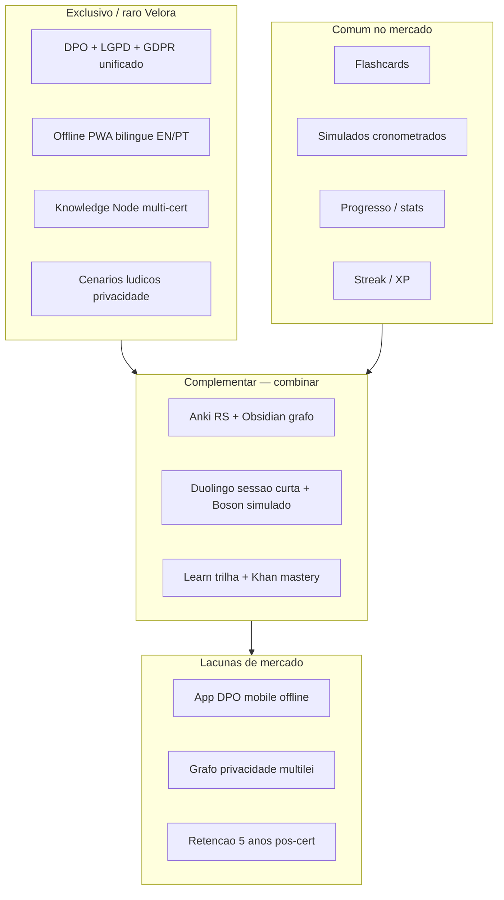

# Benchmark Estratégico — Evolução do Velora (Knowledge OS)

> **Status:** análise estratégica · **Versão:** 1.0.0  
> **Escopo:** benchmark de plataformas de aprendizagem, certificação e gestão do conhecimento  
> **Princípio:** extrair **princípios**, não copiar interfaces  
> **Contexto Velora:** [`PLATFORM-BRIEF.md`](PLATFORM-BRIEF.md) · [`PRIVACY-KNOWLEDGE-OS.md`](PRIVACY-KNOWLEDGE-OS.md)

---

## Resumo executivo

O Velora ocupa um **espaço raro no mercado**: certificação DPO/privacidade + bilingue EN/PT + offline-first + arquitetura Knowledge Node. Nenhum concorrente cobre essa interseção.

**O que o mercado faz melhor que o Velora hoje:**

| Domínio | Líder | Lição para Velora |
|---------|-------|-------------------|
| Retenção longo prazo | Anki | FSRS já iniciado — consolidar nó ↔ card |
| Micro-vitórias | Duolingo | Sessões de 5–10 min com closure claro |
| Simulação fiel | MeasureUp / Boson | Timer + revisão pré-envio + relatório por domínio |
| Pensamento conectado | Obsidian / RemNote | Grafo de nós — **core do Velora, ainda não visível na UI** |
| Trilhas oficiais | Microsoft Learn | Progresso por skill + badge de readiness |
| Explicações | Khan / Brilliant | Um conceito, múltiplas representações |

**North Star proposta:** **Mastery Score por Knowledge Node** — % de domínio consolidado (retenção + aplicação), não horas nem streak isolado.

**MVP estratégico (próximos 90 dias):** dual-write Knowledge Nodes + radar acionável + sessão de 10 min + Explain contextual — tudo offline.

---

## 1. Análises por plataforma (síntese)

Formato condensado: **Problema · Modelo mental · Incorporar · Não copiar**

---

### Flashcards

#### Anki
| Dimensão | Análise |
|----------|---------|
| **Problema** | Memória de longo prazo via repetição espaçada científica |
| **Público** | Estudantes sérios, medicina, idiomas, certificações |
| **Pilares** | FSRS/SM-2, decks, sync opcional, plugins, APKG |
| **UX** | Curva de aprendizado alta; poder total; desktop-first histórico |
| **Gamificação** | Mínima (contadores, streak de revisão) — **não copiar** gamificação pesada |
| **Modelo mental** | *Memória como sistema — revisar no momento certo* |
| **Diferencial** | Algoritmo + ecossistema APKG + comunidade |
| **Limitações** | UI datada, mobile secundário, fricção para iniciantes |
| **Incorporar** | FSRS ligado ao Knowledge Node; import APKG como adaptador |
| **Não copiar** | UI complexa, mil opções na primeira tela |

#### Quizlet
| Dimensão | Análise |
|----------|---------|
| **Problema** | Estudar rápido com conjuntos prontos e modos lúdicos |
| **Público** | K-12, universitário, casual |
| **Pilares** | Sets, Learn/Write/Spell, modo multijogador, biblioteca social |
| **UX** | Onboarding zero; busca → estudar em 2 cliques |
| **Gamificação** | Alta (Match, streaks) — útil para **treino**, não certificação |
| **Modelo mental** | *Conjunto de cartões = matéria* |
| **Diferencial** | Descoberta social, conteúdo pronto |
| **Limitações** | RS fraco vs Anki; paywall; qualidade variável |
| **Incorporar** | Busca de conteúdo por cert/trilha; modos rápidos (5 cartões) |
| **Não copiar** | Dependência de rede; feed social |

#### Brainscape
| Dimensão | Análise |
|----------|---------|
| **Problema** | Confiança (confidence-based repetition) |
| **Público** | Profissionais, idiomas |
| **Modelo mental** | *Quão confiante você está?* → agenda revisão |
| **Incorporar** | Escala 1–5 além de Again/Hard/Good/Easy (opcional, Treino) |
| **Não copiar** | Marca genérica de flashcards sem certificação |

#### RemNote
| Dimensão | Análise |
|----------|---------|
| **Problema** | Notas + flashcards + PDF no mesmo grafo |
| **Público** | Estudantes avançados, pesquisa |
| **Modelo mental** | *Documento vivo que vira memória* |
| **Incorporar** | Flashcard gerado do nó; PDF como source view (Fase 4+) |
| **Não copiar** | Editor de notas completo (escopo) |

#### Memrise
| Dimensão | Análise |
|----------|---------|
| **Problema** | Vocabulário com vídeos nativos |
| **Público** | Idiomas casual |
| **Incorporar** | Áudio/pronúncia para termos EN em questões DPO |
| **Não copiar** | Foco exclusivo em idiomas |

---

### Certificações

#### Avanset VCE / Exam Collection
| Dimensão | Análise |
|----------|---------|
| **Problema** | Simular ambiente real de prova (VCE, timer, navegação) |
| **Público** | Candidatos IT (Microsoft, Cisco, AWS…) |
| **Modelo mental** | *Prova = ritual — reproduzir stress e formato* |
| **Incorporar** | Modo simulado fiel (já parcial); relatório pós-prova por domínio |
| **Não copiar** | Dependência de dumps; ética questionável (ExamTopics) |

#### MeasureUp / Whizlabs / Boson
| Dimensão | Análise |
|----------|---------|
| **Problema** | Passar certificação vendor com banco + labs + explicações |
| **Público** | Profissionais certificáveis |
| **Pilares** | Simulados cronometrados, explicações longas, labs (Boson) |
| **Incorporar** | Explicação pós-resposta rica; readiness % antes do simulado |
| **Não copiar** | Catálogo genérico IT sem knowledge graph |

#### ExamTopics
| Dimensão | Análise |
|----------|---------|
| **Problema** | Ver questões “que caíram” (discutível) |
| **Limitações** | Qualidade, legalidade, sem pedagogia |
| **Incorporar** | **Nada** — Velora é autoral, outline-aligned |
| **Não copiar** | Modelo de brain dump |

---

### Idiomas

#### Duolingo
| Dimensão | Análise |
|----------|---------|
| **Problema** | Hábito diário de idioma com recompensa imediata |
| **Modelo mental** | *Pequenas vitórias diárias* |
| **Incorporar** | Sessões ≤10 min; closure (“+3 nós dominados”); streak **secundário** |
| **Não copiar** | Gamificação infantil; coruja; paywall agressivo |

#### Babbel / Busuu
| Dimensão | Análise |
|----------|---------|
| **Problema** | Conversação prática estruturada |
| **Incorporar** | Diálogos EN em cenários DPO (já lúdico no banco) |
| **Não copiar** | Currículo fechado só de idiomas |

---

### Knowledge Management

#### Obsidian
| Dimensão | Análise |
|----------|---------|
| **Problema** | Pensamento conectado; segunda memória |
| **Modelo mental** | *Grafo de ideias — links bidirecionais* |
| **Incorporar** | **Visualização do grafo de Knowledge Nodes**; backlinks cert→nó |
| **Não copiar** | Markdown editor como produto principal |

#### Notion
| Dimensão | Análise |
|----------|---------|
| **Problema** | Workspace tudo-em-um |
| **Incorporar** | Views múltiplas do mesmo nó (tabela mental: questão/card/caso) |
| **Não copiar** | Bloat de blocos, databases genéricas |

#### Roam / Logseq
| Dimensão | Análise |
|----------|---------|
| **Problema** | Outliner + grafo para pesquisa |
| **Incorporar** | Block references entre nós relacionados |
| **Não copiar** | Outliner como UI principal |

---

### Aprendizagem

#### Brilliant
| Dimensão | Análise |
|----------|---------|
| **Problema** | Intuição antes de fórmula; interativo |
| **Modelo mental** | *Entender, não decorar* |
| **Incorporar** | Feynman + analogia como views do nó (spec Fase 2) |
| **Não copiar** | STEM genérico |

#### Khan Academy
| Dimensão | Análise |
|----------|---------|
| **Problema** | Mastery learning com vídeo + exercício |
| **Incorporar** | “Dominou” por nó antes de avançar; mapa de skills |
| **Não copiar** | Vídeo como mídia central (bandwidth) |

#### Coursera / Udemy
| Dimensão | Análise |
|----------|---------|
| **Problema** | Curso completo com certificado |
| **Incorporar** | Trilhas = “curso” compacto; progress % por cert |
| **Não copiar** | Vídeo longo; marketplace |

---

### Treino cognitivo

#### Elevate / Peak
| Dimensão | Análise |
|----------|---------|
| **Problema** | Hábito diário de “treino mental” |
| **Incorporar** | Métricas de evolução semânticas (não jogos genéricos) |
| **Não copiar** | Minigames sem conteúdo DPO |

---

### Plataformas oficiais (Microsoft Learn, AWS, Cisco U., Google Cloud, ISC², CompTIA)

| Dimensão | Análise |
|----------|---------|
| **Problema** | Alinhar estudo ao exame oficial + credibilidade vendor |
| **Pilares** | Learning paths, sandboxes, badges, exam readiness |
| **Modelo mental** | *Skill tree oficial → exame* |
| **Incorporar** | Trilhas por cert com % readiness; link para outline público |
| **Não copiar** | Labs cloud (escopo); conteúdo proprietário |
| **Oportunidade Velora** | IAPP/EXIN não têm app mobile offline bilingue — **lacuna real** |

---

## 2. Matriz de correlação (● forte · ○ parcial · — ausente)

| Conceito | Anki | Quizlet | Duolingo | VCE | Obsidian | M.Learn | Velora hoje | Velora alvo |
|----------|------|---------|----------|-----|----------|---------|-------------|-------------|
| Repetição espaçada | ● | ○ | ○ | — | ○ | ○ | ○ FSRS | ● |
| IA tutor | ○ plugins | ○ | ● | — | ○ | ○ | ○ Explain | ● |
| Flashcards | ● | ● | ○ | — | ○ | — | ○ | ● |
| Simulados | ○ | ○ | — | ● | — | ○ | ● | ● |
| Questões adaptativas | — | ○ | ● | ○ | — | ○ | ○ smart | ● |
| Grafo conhecimento | ○ | — | — | — | ● | ○ | ○ spec | ● |
| Revisão inteligente | ● | ○ | ○ | ○ | — | ○ | ● | ● |
| Certificações DPO | — | — | — | ○ | — | ○ | ● | ● |
| Analytics domínio | ○ | ○ | ● | ● | — | ● | ● radar | ● |
| Offline | ● | ○ | ○ | ○ | ● | — | ● | ● |
| PWA | ○ | ● | ● | — | — | — | ● | ● |
| Multilíngue UI | ○ | ● | ● | ○ | ○ | ● | ○ PT/EN | ● |
| Bilingue conteúdo | ○ | ○ | ● | — | — | — | ● dual | ● |
| Gamificação | ○ | ● | ● | — | — | ● | ○ XP | ○ leve |
| Trilhas | ○ | ○ | ● | ○ | ○ | ● | ● | ● |
| Import APKG/CSV | ● | ○ | — | — | ○ | — | ○ | ● |
| Explicações ricas | ○ | ○ | ○ | ● | ○ | ● | ○ | ● |
| Casos práticos | — | — | — | ○ | ○ | ● | ○ | ● |
| Readiness exame | — | — | — | ● | — | ● | ○ | ● |
| Comunidade | ● | ● | ○ | ○ | ● | ○ | — | ○ Fase 5 |
| Mobile-first | ○ | ● | ● | ○ | ○ | ○ | ● | ● |
| Acessibilidade | ○ | ○ | ○ | ○ | ○ | ● | ○ | ● |
| Knowledge Node canônico | — | — | — | — | ○ | ○ | ○ | ● |

---

## 3. Sobreposição de funcionalidades



**Redundâncias a evitar no Velora:** duplicar Quizlet (social sets) + Anki (deck manager) + Notion (editor) — **um nó, várias views**.

**Oportunidades:** readiness por cert; grafo visual; sessão 10 min; mastery score.

**Lacunas atuais Velora:** grafo não visível; nodes não persistidos; player/modal ainda “simulador-first”.

---

## 4. Simplificação — perguntas contínuas

| Funcionalidade | Problema real? | Forma mais simples | Classificação |
|----------------|----------------|-------------------|---------------|
| Knowledge Node persistido | Sim — evita duplicação | Dual-write já spec | **Essencial** |
| Radar domínios | Sim — “onde falho?” | Já shipped | **Essencial** |
| Grafo visual | Sim — diferencial Obsidian | View read-only, 1 clique | **Importante** |
| XP / nível | Parcial — motivação | Manter leve; não competir com Duolingo | **Importante** |
| Comunidade / ranking | Não agora | Fase 5 | **Futuro** |
| Editor Notion-like | Não | Questão modal basta | **Desnecessário** |
| VCE dumps | Não (ética) | Simulado autoral | **Desnecessário** |
| Vídeo aulas | Não core | Texto + Explain | **Futuro** |
| i18n 100% UI | Sim (EN study) | Completar strings | **Essencial** |
| Labs cloud | Não escopo | Casos texto | **Futuro** |
| APKG import | Sim — migração Anki | Adaptador | **Importante** |

---

## 5. MVP — menor conjunto para experiência extraordinária

**Definição:** candidato DPO consegue, em **3 cliques**, iniciar sessão de 10 min que ataca lacunas reais e vê progresso de mastery — **offline, PT ou EN**.

| # | Feature | Por quê |
|---|---------|---------|
| 1 | Knowledge Node dual-write | Fundação arquitetural |
| 2 | Sessão 10 min (smart + preset) | Duolingo-like closure |
| 3 | Radar → “Estudar lacunas” | Boson-like actionable analytics |
| 4 | Explain contextual offline | Diferencial vs VCE dumps |
| 5 | Flashcard = view do nó | Anki sem fricção |
| 6 | Readiness % por cert | Microsoft Learn pattern |
| 7 | i18n UI completo | Público bilingue |
| 8 | FAQ + onboarding 60s | Quizlet-like zero friction |

**Fora do MVP:** grafo 3D, comunidade, APKG, vídeo, labs, marketplace.

---

## 6. North Star Metric

### Proposta: **Mastery Score consolidado**

```
Mastery = média ponderada por Knowledge Node de:
  - acurácia em revisões espaçadas (40%)
  - estabilidade FSRS / intervalo (30%)
  - aplicação em simulado por domínio (20%)
  - recência de revisão (10%)
```

**Por quê não só streak ou horas?**

| Métrica | Problema |
|---------|----------|
| Horas estudadas | Vanity — não garante retenção |
| Streak | Duolingo trap — decorar sem dominar |
| Aprovação simulado | Curto prazo — esquece após prova |
| XP | Gamificação vazia |

**Métrica secundária:** **Certification Readiness %** (por cert escolhida).  
**Métrica de produto:** **Weekly Active Learners com Mastery Δ > 0**.

---

## 7. Arquitetura — suporta a visão?

### Estado atual (jul/2026)

| Camada | Status | Gap |
|--------|--------|-----|
| Knowledge Node (spec) | Fase 1 read-only | Sem persistência `ef_knowledge_nodes_v1` |
| Views (questão, card) | Parcial | Sem Feynman/caso |
| FSRS | Implementado | Desacoplado do Node ID canônico |
| Analytics | Radar + KPIs | Derivado de stats, não nodes |
| i18n | Parcial | Player/modal PT-only |
| Monolito | OK para MVP | Modularizar por módulos JS Fase 3 |

### Melhorias propostas

1. **Entidade canônica:** `KnowledgeNode` — `nodeId`, `locales[]`, `views[]`, `certRefs[]`, `domainTags[]`
2. **Eliminar redundância:** questão não duplica texto EN/PT — `localeVariants` no nó
3. **Stats por nodeId**, não só `questionId`
4. **Event log local** (`ef_events_v1`) — sessão, review, rating — alimenta mastery
5. **View registry:** `{ question, flashcard, feynman, case, explain }` — plugável
6. **Sync opcional Fase 5** — CRDT ou export bundle; offline permanece default

```text
KnowledgeNode
 ├── metadata (domain, bloom, difficulty)
 ├── locales { pt, en }
 ├── views { question, flashcard, feynman, ... }
 ├── certReferences [ CIPP/E, LGPD, ... ]
 └── stats (mastery, fsrs, history refs)
```

---

## 8. Roadmap em fases

### Fase 1 — Fundação (0–3 meses) · **impacto alto, complexidade baixa**

- Dual-write Knowledge Nodes
- Mastery Score v1 (derivado de stats existentes)
- i18n UI 100%
- Readiness % por certificação
- Consolidar Player P1 + modal (já shipped)

### Fase 2 — Retenção (3–6 meses)

- Views: Feynman, analogia, mnemônico (spec)
- FSRS atrelado a `nodeId`
- Sessão 10 min com closure UX
- APKG import adaptador
- Grafo read-only (nós + arestas por cert/domínio)

### Fase 3 — Aplicação (6–12 meses)

- Casos práticos por lei (LGPD incident, DPIA…)
- Comparativo multi-país no mesmo nó
- Modularizar monolito (ES modules, sem framework)
- Dashboard tutor (“o que estudar hoje?”)

### Fase 4 — Escala conteúdo (12–18 meses)

- Geração assistida de views (IA local/cloud opt-in)
- PDF/import como source → nó
- Expandir banco 301 → 1000+ nós
- Sync backup criptografado opt-in

### Fase 5 — Ecossistema (18+ meses)

- Decks comunitários curados (moderados)
- API export/import bundle
- Parcerias outline IAPP/EXIN (metadados, não dumps)
- Desktop wrapper (Tauri) se PWA limitar

**Sempre:** mobile-first, offline-first, regra 3 cliques.

---

## 9. Se eu criasse o Velora hoje, do zero

Sabendo o que Anki, Duolingo, Obsidian e MeasureUp levaram décadas a descobrir:

### 1. Começaria pelo **nó**, não pela questão

Uma entidade `PrivacyConcept` com variantes EN/PT. Tudo else é render.

### 2. Três modos de uso, um app

| Modo | Duração | Inspiração |
|------|---------|------------|
| **Micro** | 5–10 min | Duolingo |
| **Deep** | 45–90 min | Boson simulado |
| **Explore** | aberto | Obsidian grafo |

Um botão na Home — não três apps.

### 3. Analytics = ação, não dashboard

Radar sem botão “estudar lacunas” é vanity. **Todo gráfico → CTA.**

### 4. Bilingue nativo, não tradução

Mesmo `nodeId`, dois locales — aprender inglês técnico **no fluxo**, não curso separado.

### 5. Offline como superpoder

DPO viaja, metrô, avião. PWA + localStorage vence Learn que exige rede.

### 6. IA invisível

Sem menu “AI”. **Explain** no contexto da questão errada — Khan meets tutor.

### 7. Certificação sem dumps

Outline-aligned, autoral, lúdico — ética como diferencial vs ExamTopics.

### 8. Gamificação mínima

Mastery Score > coruja. Streak como **secundário**, nunca punitivo.

### 9. Onboarding 60 segundos

“Escolha sua cert → sessão 10 min → viu radar”. FAQ para curiosos.

### 10. Monolito primeiro, modular depois

Ship fast no GitHub Pages; extrair módulos quando dói — não antes.

---

## 10. Conclusão estratégica

Velora **não precisa ser** o melhor Anki, Duolingo ou Obsidian.

Precisa ser o **único Knowledge OS** que une:

- certificação DPO multijurisdição  
- retenção de longo prazo  
- aplicação prática  
- bilingue EN/PT  
- offline mobile  
- simplicidade extrema  

**Vencer** = mastery consolidado meses após passar na prova — nenhum VCE ou Quizlet otimiza isso hoje no nicho privacidade.

---

## Referências internas

- [`MANIFESTO-ARQUITETURA.md`](MANIFESTO-ARQUITETURA.md)
- [`KNOWLEDGE-MODEL.md`](KNOWLEDGE-MODEL.md)
- [`PRIVACY-KNOWLEDGE-OS.md`](PRIVACY-KNOWLEDGE-OS.md) — Fases 1–6
- [`PLATFORM-BRIEF.md`](PLATFORM-BRIEF.md)

---

*Documento gerado para orientar produto, UX e engenharia. Revisar trimestralmente.*
