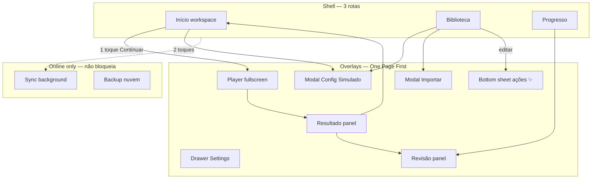

# Velora — Modelo de Repaginação de Interface

> **Status:** especificação de design — complementa [Manifesto](MANIFESTO-ARQUITETURA.md), [Knowledge Model](KNOWLEDGE-MODEL.md) e [Design System](../branding/design-system/design-system.md).  
> **Prioridade:** Offline-first obrigatório · Mobile-first · Navegação aprovada (bottom bar + sidebar ≥1024px)

**Canvas interativo:** abrir [`velora-ui-redesign-model.canvas.tsx`](../../Users/81008280/.cursor/projects/c-temp-Workshop-Cursor/canvases/velora-ui-redesign-model.canvas.tsx) ao lado do chat.

---

## 1. Princípios de design

### 1.1 Offline-first na UI (não negociável)

| Regra | Implementação |
|-------|----------------|
| **App nunca bloqueia offline** | Remover tela cheia "Você está off-line"; app 100% utilizável |
| **Indicador sutil** | Pill persistente no topbar: `Offline` / `Online` — nunca modal bloqueante |
| **Dados locais = fonte imediata** | localStorage / IndexedDB; UI lê local primeiro |
| **Online = enhancement** | Sync, backup nuvem, import remoto — opcional, em segundo plano |
| **PWA cache** | Service Worker para shell + assets; conteúdo do usuário já é local |
| **Feedback de sync** | Toast discreto ao reconectar: "Sincronizado" — não interrompe estudo |

### 1.2 Herança do manifesto

- **Knowledge OS:** UI mostra *visualizações* (simulado, cards, biblioteca) do mesmo conhecimento — não módulos isolados.
- **Regra dos 3 cliques:** CTAs primários sempre visíveis; fluxos profundos em drawer/modal.
- **One Page First:** 3 rotas shell + overlays — nunca proliferar páginas.
- **IA invisível:** ações ✨ contextuais no player/biblioteca — sem aba "IA".
- **Home = workspace:** 4 perguntas, zero landing page.

### 1.3 Referências visuais

Linear · Raycast · Notion · GitHub · Obsidian · Anki — **profissional, denso, calmo**.

Evitar: gamificação infantil, dashboards com dezenas de cards, gradientes em todo lugar.

Tokens: roxo `#9333EA`, teal `#06B6D4`, gold `#FBBF24`, base `#0B0E14` — ver design system.

---

## 2. Shell — layout por breakpoint

Navegação **aprovada pelo usuário** — manter como padrão fixo.

### 2.1 Mobile (`< 640px`)

```
┌─────────────────────────────┐
│ Topbar: logo · título · ⚙   │  ← pill Offline/Online aqui
│         [pill: Offline]     │
├─────────────────────────────┤
│                             │
│   WORKSPACE (scroll conteúdo)│
│   uma tarefa principal       │
│                             │
├─────────────────────────────┤
│ [Início] [Biblioteca] [Prog]│  ← bottom tab bar, 44px+ touch
└─────────────────────────────┘
```

- Modais e player: **fullscreen** (`100dvh`)
- Ações secundárias: **bottom sheet** (polegar)
- Safe area: `env(safe-area-inset-bottom)`

### 2.2 Tablet (`640px – 1023px`)

```
┌─────────────────────────────┐
│ Topbar + status offline     │
├──────────────┬──────────────┤
│ Lista/master │ Detalhe      │  ← master-detail quando couber
│ (40%)        │ (60%)        │
├──────────────┴──────────────┤
│ [Início] [Biblioteca] [Prog]│  ← bottom bar mantida (aprovada)
└─────────────────────────────┘
```

- Biblioteca: árvore à esquerda, preview questão à direita
- Simulado config: resumo sticky + form (já implementado parcialmente)

### 2.3 Desktop (`≥ 1024px`)

```
┌──────┬──────────────────────────────────┐
│ Velora│ Topbar · breadcrumb · ⌘K · offline│
│ ─────│──────────────────────────────────│
│ Início│                                  │
│ Biblio│   WORKSPACE (split view)         │
│ Progr │   [ painel A | painel B ]        │
│      │                                  │
└──────┴──────────────────────────────────┘
 260px sidebar · labels completos
```

- **Command palette** (`Ctrl+K`): buscar certificação, questão, ação
- Split view: player + navegação lateral de questões
- Drag & drop na biblioteca (fase posterior)

---

## 3. Mapa de telas (information architecture)



| Superfície | Tipo | Offline | Cliques típicos |
|------------|------|---------|-----------------|
| Início | Rota shell | Sim | Continuar: 1 |
| Biblioteca | Rota shell | Sim | Cert → simulado: 2 |
| Progresso | Rota shell | Sim | Ver erro: 2 |
| Config simulado | Modal wide/fullscreen | Sim | Iniciar: 2–3 |
| Player | Overlay fullscreen | Sim | Responder: 1 |
| Resultado | Panel (mesma rota) | Sim | Revisar erros: 1 |
| Settings | Drawer direita | Sim | — |
| Importar | Modal | Sim (arquivo local) | 2 |
| Command palette | Popover | Sim (busca local) | Desktop |

**Proibido:** nova rota para Builder, Export, Profile — integrar em Biblioteca ou drawer.

---

## 4. Camadas offline vs online

```
┌─────────────────────────────────────────┐
│  CAMADA UI (sempre disponível)          │
├─────────────────────────────────────────┤
│  CAMADA LOCAL (localStorage + IDB)      │  ← READ/WRITE offline
│  · nós/questões · exames · histórico    │
│  · FSRS · settings · sessão ativa       │
├─────────────────────────────────────────┤
│  CAMADA CACHE (Service Worker)          │  ← shell + assets offline
├─────────────────────────────────────────┤
│  CAMADA SYNC (opcional, online)         │  ← background, não bloqueia
│  · backup · import URL · futura nuvem   │
└─────────────────────────────────────────┘
```

### Indicador offline (substituir tela bloqueante)

**Antes (rejeitar):** tela cheia logo + "Você está off-line" — usuário não estuda.

**Depois (obrigatório):**

| Estado | UI | Comportamento |
|--------|-----|---------------|
| Offline | Pill `Offline` no topbar (cinza/teal muted) | App normal; dados locais |
| Online | Pill oculta ou `Online` discreto | Habilita sync em background |
| Sync pendente | Pill `Sync…` + spinner mínimo | Não bloqueia toques |
| Sync erro | Toast + pill `Sync falhou` | Retry manual em Settings |

Posição: topbar direita, antes do botão ⚙. Mobile: só ícone nuvem riscada + label curto.

---

## 5. Sistema de componentes

### 5.1 Shell

| Componente | Responsabilidade |
|------------|------------------|
| `AppShell` | Grid flex: sidebar OR bottom bar + main |
| `Topbar` | Título rota, breadcrumb desktop, offline pill, ⚙ |
| `NavSidebar` | ≥1024px — logo + 3 itens com label |
| `NavTabbar` | <1024px — 3 ícones + label |
| `Workspace` | Área scrollável principal |
| `OfflineBadge` | Pill de conectividade |

### 5.2 Superfícies de conteúdo

| Componente | Uso |
|------------|-----|
| `WorkspaceHero` | Card único CTA "Continuar" (Home) |
| `ProgressRing` | Anel compacto de progresso certificação |
| `ListRow` | Item biblioteca / histórico — touch 44px |
| `BankTree` | Accordion trilha → cert → domínio |
| `HubTabs` | 2 colunas Certificações / Questões |
| `StatStrip` | 3–4 métricas inline (Progresso) |

### 5.3 Overlays

| Componente | Mobile | Desktop |
|------------|--------|---------|
| `Modal` | Fullscreen | Centered wide (820px) |
| `Drawer` | Bottom sheet 90vh | Panel direita 400px |
| `Popover` | Anchored menu | Idem |
| `CommandPalette` | Busca fullscreen | Popover central ⌘K |

### 5.4 Player (estudo)

```
┌─ progress bar ─────────────────────┐
│ Q 12/50 · timer        [marcar]    │
├────────────────────────────────────┤
│ enunciado                          │
│ [ opções ]                         │
│ [ ✨ Explicar ]  ← IA invisível    │
├────────────────────────────────────┤
│  ◀   [1][2][3]…   ▶    [Finalizar] │
└────────────────────────────────────┘
```

- Footer fixo; navegação por polegar
- Desktop: grid questões à direita (split)

---

## 6. Home — workspace (4 perguntas)

Sem scroll para descobrir funcionalidades. Above the fold:

```
┌─────────────────────────────────────┐
│ Olá · streak · nível XP (compacto)  │  ← progresso
├─────────────────────────────────────┤
│ ┌─────────────────────────────────┐ │
│ │  CONTINUAR                      │ │  ← onde parei + o que fazer
│ │  ISFS · questão 12/50 · 18 min  │ │
│ │              [ ▶ ]              │ │
│ └─────────────────────────────────┘ │
├─────────────────────────────────────┤
│ Recomendado: Revisar 3 erros        │  ← próxima ação
│ [Revisar] [Novo simulado]           │
├─────────────────────────────────────┤
│ Certificações (compact list)        │  ← o que está disponível
│ ISFS · PDPF · PDPP                  │
└─────────────────────────────────────┘
```

Remover: cards decorativos, múltiplos CTAs competindo, texto marketing.

---

## 7. Fluxos principais

### 7.1 Continuar estudo (1 toque)

Início → tap Continuar → Player (restaura sessão `ef_session`)

### 7.2 Novo simulado (2–3 toques)

Biblioteca → certificação → Config modal → Iniciar  
OU Início → Novo simulado → modal

### 7.3 Revisar erro (1–2 toques)

Progresso → última prova → Revisar erros  
OU Início → Revisar N erros

### 7.4 Importar (2 toques)

Biblioteca → ⋯ Importar → modal → arquivo local (offline OK)

### 7.5 Cards / FSRS (2 toques)

Biblioteca → cert → Revisão inteligente (overlay player cards)

---

## 8. PWA e storage na UI

Settings drawer (não nova página):

| Seção | Conteúdo |
|-------|----------|
| Aparência | Dark/light, fonte, tamanho |
| Estudo | Timer padrão, randomização |
| Dados locais | Espaço usado, export backup JSON |
| Offline | Status SW, versão cache, "Atualizar app" |
| Online (futuro) | Conta, sync, último backup |

Backup/restore: export `localStorage` blob — crítico para offline-first.

---

## 9. Wireframes ASCII — offline badge

**Mobile topbar:**
```
[◆ Velora]  Início          [☁̸ Off] [⚙]
```

**Desktop topbar:**
```
Início › Continuar                    [Offline] [⌘K] [⚙]
```

**Nunca:**
```
        [  LOGO V  ]
     Você está off-line
        (tela vazia)
```

---

## 10. Roadmap de implementação visual

| Fase | Escopo | Quebra app? |
|------|--------|-------------|
| **V1** | Offline badge no topbar; remover tela bloqueante offline | Não |
| **V2** | Home workspace (4 perguntas); reduzir cards | Não |
| **V3** | Player + modal polish mobile (já parcial) | Não |
| **V4** | Tablet master-detail Biblioteca | Não |
| **V5** | Desktop command palette + split player | Não |
| **V6** | Settings drawer unificado | Não |
| **V7** | Sync layer UI (online opcional) | Não |

Cada fase = PR isolado em `index.html` + `sync_exam_modal.py` quando modal.

---

## 11. Checklist por componente novo

1. Funciona offline sem rede?
2. Mobile first — testado em 375px?
3. ≤ 3 cliques para ação principal?
4. É modal/drawer em vez de nova rota?
5. Offline badge visível mas não intrusivo?
6. Alinhado ao Knowledge OS (visualização, não módulo)?
7. Tokens do design system — sem cores hardcoded?

---

## 12. Referências

- [MANIFESTO-ARQUITETURA.md](MANIFESTO-ARQUITETURA.md)
- [KNOWLEDGE-MODEL.md](KNOWLEDGE-MODEL.md)
- [design-system.md](../branding/design-system/design-system.md)
- Código shell atual: `#tabbar`, `#velora-overrides`, `@media (min-width:1024px)` em `index.html`
